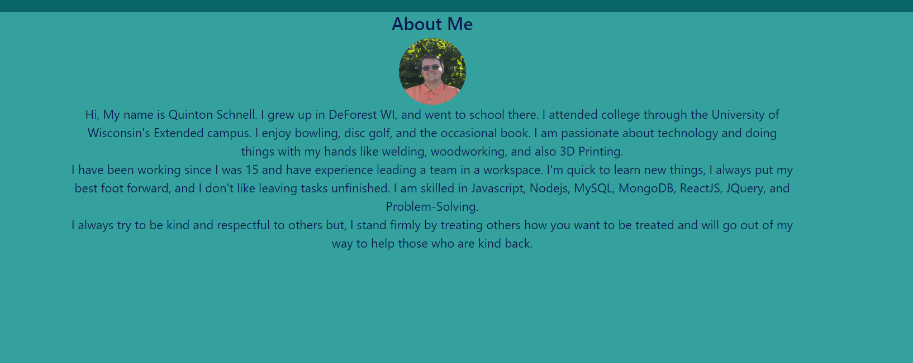

 
# React Portfolio.

## Description
This is the secondversion of my portfolio page, updated using react. I created this as a way for future employers to have all the information they would like about me in one spot. I learned more practical applications of css and react.

## Table of Contents

- [Installation](#installation)
- [Usage](#usage)
- [License](#license)

## Installation
There is no installation required. All applications should work on opening the website.

## Usage
This website has 4 features. At the top of the page, there are 3 quick-find links that jump you to different sections of the page. A page with my Current Resume on it. A form page that valatates the three input feilds as theyare typed. Then there is the portfolio page where 6 pices of my work are displayed with links to the live site and to the github reposatory.

## License

Copyright 2023, 

    Permission is hereby granted, free of charge, to any person obtaining a copy of this software and associated documentation files (the “Software”), to deal in the Software without 
    restriction, including without limitation the rights to use, copy, modify, merge, publish, distribute, sublicense, and/or sell copies of the Software, and to permit persons to whom 
    the Software is furnished to do so,subject to the following conditions:
    The above copyright notice and this permission notice shall be included in all copies or substantial portions of the Software.
    THE SOFTWARE IS PROVIDED “AS IS”, WITHOUT WARRANTY OF ANY KIND, EXPRESS OR IMPLIED, INCLUDING BUT NOT LIMITED TO THE WARRANTIES OF MERCHANTABILITY, FITNESS FOR A PARTICULAR PURPOSE 
    AND NONINFRINGEMENT. IN NO EVENT SHALL THE AUTHORS OR COPYRIGHT HOLDERS BE LIABLE FOR ANY CLAIM, DAMAGES OR OTHER LIABILITY, WHETHER IN AN ACTION OF CONTRACT, TORT OR OTHERWISE, 
    ARISING FROM, OUT OF OR IN CONNECTION WITH THE SOFTWARE OR THE USE OR OTHER DEALINGS IN THE SOFTWARE.
(https://opensource.org/licenses/MIT)
